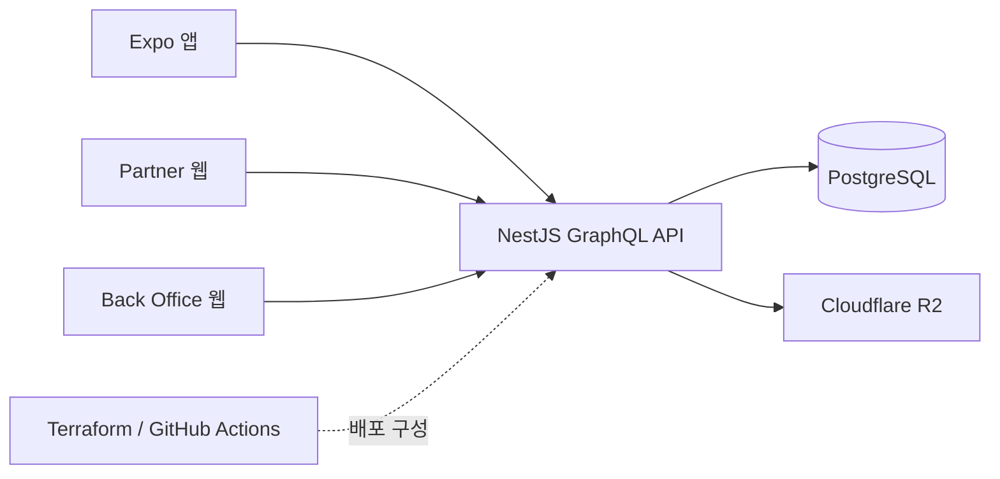

# 다담장

상품을 발견하고 저장하는 구매자 앱부터 파트너 상품 운영, 관리자 심사까지 하나의 흐름으로 구현한 커머스 포트폴리오 프로젝트입니다.

## 서비스 구성

| 영역 | 사용자 | 주요 기능 |
| --- | --- | --- |
| FO | 구매자 | 상품 탐색·검색, 위시, 장바구니, 주문, 스타일 콘텐츠, 알림 |
| Partner | 입점 파트너 | 상품 등록·수정, 이미지와 SKU 관리, 심사 요청과 판매 상태 확인 |
| BO | 운영 관리자 | 파트너·상품 심사, 주문·카테고리·관리자·감사 로그 관리 |



## 저장소

| 저장소 | 내용 |
| --- | --- |
| [`dadamjang-fe`](./dadamjang-fe) | Expo 구매자 앱과 Next.js Partner·BO 앱 |
| [`dadamjang-be`](./dadamjang-be) | NestJS GraphQL API와 커머스 도메인 |
| [`dadamjang-infra`](./dadamjang-infra) | 로컬 개발 환경과 AWS·Cloudflare 인프라 정의 |

각 디렉터리는 독립 저장소를 연결한 Git submodule입니다.

## 기술적 초점

- 세 클라이언트가 하나의 GraphQL 계약을 사용합니다.
- Checkout 중복 요청을 idempotency key와 PostgreSQL transaction으로 제어합니다.
- 메일·푸시 전송은 outbox worker로 요청 처리와 분리합니다.
- 업로드 이미지는 비공개 pending bucket에서 검증한 뒤 공개 영역으로 승격합니다.
- 모바일 UI는 iOS와 Android의 네이티브 표현을 각각 사용합니다.
- Terraform과 OIDC 기반 GitHub Actions로 staging·e2e 인프라와 배포 흐름을 정의합니다.

## 로컬 실행

```bash
git clone --recurse-submodules https://github.com/dadamjang-dot/dadamjang-workspace.git
cd dadamjang-workspace

cd dadamjang-be
cp .env.example .env
pnpm install
pnpm db:up
pnpm migrate
pnpm start:dev
```

다른 터미널에서 프런트엔드를 실행합니다.

```bash
cd dadamjang-fe
pnpm install
cp apps/dadamjang-fo/.env.example apps/dadamjang-fo/.env
pnpm --dir apps/dadamjang-fo start
```

Partner와 BO는 각각 `pnpm partner:dev`, `pnpm bo:dev`로 실행합니다.

## 구현 범위

- 주문은 결제 연동 전 단계인 mock checkout이며 실제 결제와 재고 차감은 포함하지 않습니다.
- Terraform 검증과 staging plan은 자동화되어 있지만 apply 경로는 저장소에 포함하지 않았습니다.
